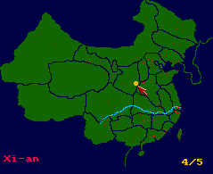
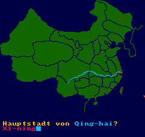
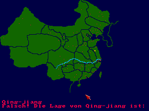

Do you know the location and name of the *125* largest Chinese cities? And do you know the provincial capitals?

This quiz game has several game modes:
* **Point-to-city**: Find a city on the map. There are three difficulty levels. On *level 1*, only the *20* largest mega-cities are asked, whereas on *level 3* you get the full list of *125* cities.
* **Name-by-location**: Find the city name based on its location. Again, three difficulty levels.
* **Capitals Mode**: Find the name of the capital city for a given [province](https://en.wikipedia.org/wiki/Province-level_divisions_of_China) or [autonomous region](https://en.wikipedia.org/wiki/Autonomous_regions_of_China) (AR). Or, alternatively, find the name of the province or AR based on the city.



# Trivia

* The original editor is included: `ChinaCityEditor`. It exports a generated Blitz2 file to the ram disk for further processing.
* The names are mostly [Pinyin](https://en.wikipedia.org/wiki/Pinyin) except for some cities in *AR* (Lhasa,...) and the province 陕西 (Shaan-xi) for which [another system](https://en.wikipedia.org/wiki/Gwoyeu_Romatzyh) is used for disambiguation. Also the syllables are separated by hyphens which is ideal for Pinyin learners.
* The game language is *German* - but you only need to know some key words in order to play it.
* The map was drawn by hand in [Deluxe Paint](https://en.wikipedia.org/wiki/Deluxe_Paint), as it's hard to come by a scanner in *1996*.
* The selection of cities and their size are taken from an atlas published in *1987* (this is why there are some fossils like [Qing-jiang for Huai-an](https://en.wikipedia.org/wiki/Huai%27an)). This information is still not there on the internet, speaking of *1996*, of course.
* The blinking city dots are reminiscent of [Topo 64](https://www.mobygames.com/game/206358/topographie-deutschland/screenshots/c64/1133843/).

# How to Use

Put the repository into a mounted directory of an *emulated* [Amiga 500](https://en.wikipedia.org/wiki/Amiga_500) and run the executable in `bin` from the shell:
```
cd bin
ChinaCityQuiz
```

You can also start using the workbench (`info`-files provided).

The game is completely written in [Blitz Basic 2](https://de.wikipedia.org/wiki/Blitz_Basic). Its source code (both [ASCII](https://en.wikipedia.org/wiki/ASCII) and [tokenized](https://en.wikipedia.org/wiki/Lexical_analysis#Tokenization)) is also provided and can be run from the [IDE](https://en.wikipedia.org/wiki/Integrated_development_environment) if adjusting the compiler options:
* Default *Compile buffers* to be increased by factor *10*.

# Gallery

|  |
| :--: |
| Capitals mode: Enter the capital<br>for a given province and vice-versa |

|  |
| :--: |
| Point-to-city mode: Find the given city |
